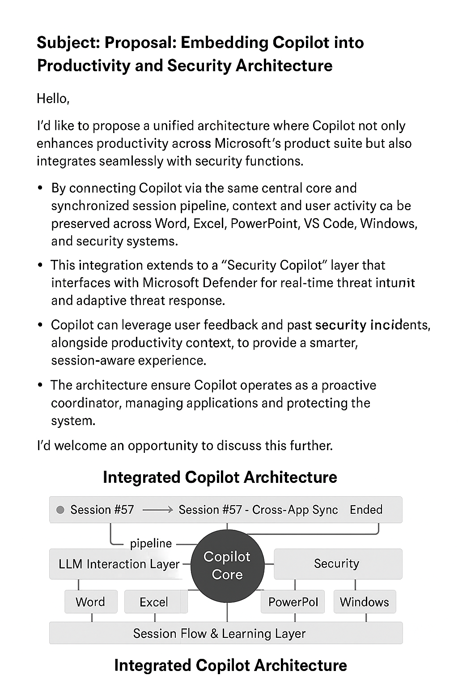

# Copilot Core Architecture Proposal

This proposal outlines a unified Copilot Core architecture that connects Microsoft 365, GitHub Copilot, Windows, and Security Copilot through session-based orchestration.

## 🔧 Key Concepts

- **Session-based orchestration** across apps
- **LLM integration** with real-time context
- **Security Copilot** + Windows telemetry
- **Feedback loop** for learning and personalization

## 📎 Proposal PDF

[📄 Download the full proposal (PDF)](Copilot_Core_Architecture_Proposal_JI_INSU.pdf)

## 🧠 Architecture Diagram

## 🙋 Author

**JI INSU**  
AI Workflow Designer  
[LinkedIn Profile](https://www.linkedin.com/in/insuji)
